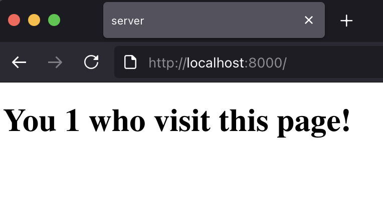
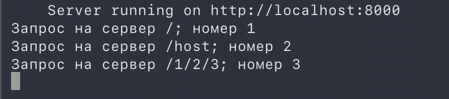
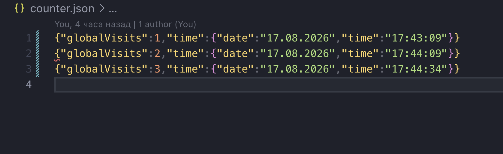

<header>
<div align="center">
  
  <h1>Simple HTTP Server 🔌</h1>
  <h2>This <i>HTTP server</i> is written in <b>Node.js</b> with the popular framework <b>Express.js</b>.</h2>

<a>  </a>
<a>  </a>
<a>  </a></n>
<a href="https://github.com/codi-mvp">

</a>

</div>
</header>

# 💡About Server

## Features

- Starting on port 8000(default), in console you see server logs.
<p>
  
</p>
- Every request saving to _counter.json_ with time.
<p>
  
</p>
- The counter resets after every 100 requests, but its last value is preserved.
<p>
  
</p>

## API Reference

#### How to test

```http
  GET /
```

## Run Locally

Clone the project

```bash
  git clone https://github.com/codi-mvp/http-server
```

Go to the project directory

```bash
  cd http-server
```

Install dependencies

```bash
  npm install
```

Start the server

```bash
  npm start
```
